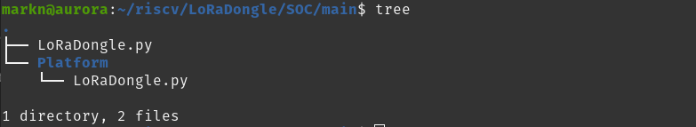

# Building the SOC and Loading the SOC
## Cloning the Repository
The first step is to clone the repository found at [https://github.com/marrrk/LoRaDongle](https://github.com/marrrk/LoRaDongle). This can be done as usual, however if you want to view the kicad project for the schematic and PCB layout, clone the submodules as well via the command `git clone --recurse-submodules https://github.com/marrrk/LoRaDongle.git`. This clones the relevant libraries that some of the symbols and footprints are sourced from.

From henceforth, every path described will be from the root of the LoRaDongle directory. 

## Lattice FPGA
Navigate to the SOC directory, `SOC/main` to find the two python scripts required to successfully build the SOC:



* The platform(`Platform/LoRaDongle.py`) that contains the physical represantion of the board and it's peripherals.
* The target(`LoRaDongle.py`) that contains the code that generates the SOC. 

### Generating and Loading the Bitstream
If the prerequisites have been installed correctly, running the target script with the necessary arguments will lead to the SOC being successfully built and loaded onto the board. This can be done with the command:
```
python LoRaDongle.py --cpu-type serv --build --flash
```
Once the script has been run, a new directory is created that contains the generated gateware and software. Both are necessary to sucessfully run a program on the SoC. The `gateware` directory contains the generated bitstream to be loaded onto LoRaDongle while the `software` directory contains the bios and various peripherals and header files that are used in writing a program for the SOC.

The iCE40UP5k has minimal logic slices and so the SoC is designed with the ROM region located in the external SPIFlash. For this region, the LiteX bios is not loaded into memory and rather we tell the CPU where to jump to start reading the application program. Therefore, in order to see if it was successful, we need to load the program into the SoC. See [Programming SoC](programming_SOC) for more details.


## Xilinx FPGA
### Generating Bitsream
Building the SOC is as simple as running a single script. It is important to make sure the environment is set up properly for the successful completion of the script. Two Things that may need to be setup prior to running are:
* The Litex Virtual environment is being used.
* The command `vivado` is in the path. You can do this by calling: `$ source /PATH_TO_VIVADO_INSTALL/VERSION_NUMBER/settings64.sh`

If the environment is setup correcly, navigate to `LoRaDongle/arty_test`. The SOC can be built using `python arty.py`.

This will take a few minutes to run, and if successful, the generated bitstream will be loaded to: `LoRaDongle/SOC/arty_test/build/gateware/top.bit`.

### Loading Bitstream
To load the bitstream, no shortcut way has been implemented as of yet. As such you need to manually run vivado and load the bitsream via the Graphical User Interface is done. The following steps are followed:
1. Open Vivado
2. Open Dummy Project (any project can be used, even an example project)
3. Connect Digilent Board to computer
4. Open Hardware Manager (on the bottom left of the screen)
5. Click Open target and then auto connect. 
6. Click Program Device
7. Look for the location that `top.bit` was generated for your SOC
8. Click Program

The SOC will then be loaded into the FPGA.

You can test it out by calling:
```bash
$ litex_term /dev/ttyUSB1
```
This will launch the liteX bios on the fpga, and you will be able to see some information about the SoC generated.


## Generating Documentation
The python script to build the SoCs also generate html documentation for the various cores, peripherals, memory regions and registers. the [LiteX Wiki](https://github.com/enjoy-digital/litex/wiki/SoC-Documentation) outlines what python modules need to be installed with `pip` in order to generate the documentation.

To generate the documentation, run the following command:

```bash
sphinx-build -M html build/documentation/ build/documentation/_build
```