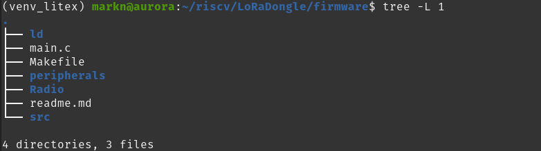
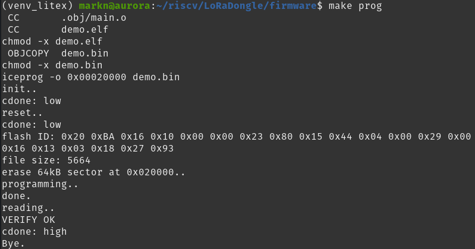
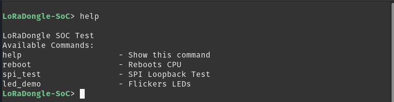
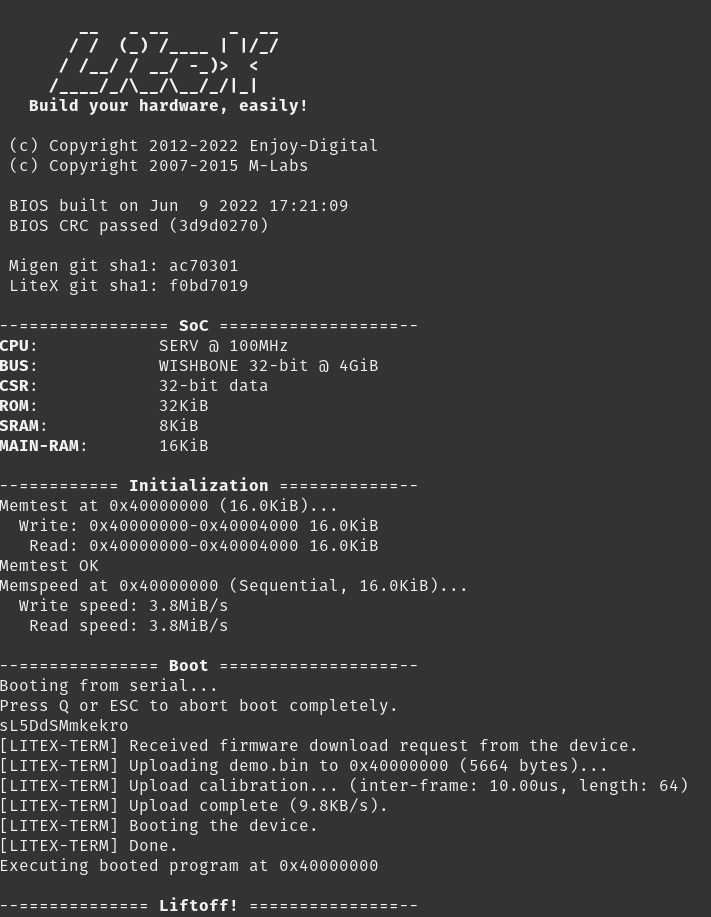

## Generated Files

The softwate build directory contains a subdirectory `software/include/generated` that stores core files for the successful programming of the SOC. This includes linker scripts, makefile extensions and crucial header files.

Specifically, important linker information is found in `output_format.ld` and `regions.ld`. These would need to be included in the linker script of your application such that the correct memory locations are utilised. `variables.mak` stores useful macros for use in the makefile of your application.

Every peripheral in the SoC is controlled via memory mapped registers called CSRs. In order to interact with the peripherals, the specific registers in memory need to be written to.

For example, including GPIO pins in the SOC creates a CSR register that needs to be written to or read from in order to set or read the status of the corresponing pins Thankfully, part of the generated files from building the SOC contains all the CSR addresses as well as functions that handle writing and reading from the peripherals. The file that contains all these functions is`csr.h`.

The included makefile in the `firmware` directory is configured to look into this folder for the necessary files during the compilation process.

## Building and running the Test Program - LoRaDongle Demo Test

### File Structure

Navigate to the `firmware` directory in the project, the current file structure is shown in the image below:

    

The purpose of the subdirectories is as follows:

* `ld/` - Contains the main linker script to link binaries together
* `peripherals/` - Code and drivers that interact with the peripherals of the system.
* `Radio/` - Driver code for the LoRa radio

The makefile reads all the source and linker files from these directories, in addition to assembly start up code found in the LiteX install and `main.c`. To create the executable, run the makefile command `make`. The compilation results in the binary file `demo.bin` that can be loaded onto LoRaDongle's SPI Flash at a specific memory address that the CPU reads from to execute the program. This is done with the command `make prog`. 

The successful ouput of that is shown below:

    

If successful, the two green LEDS on the board should flicker for about 3 seconds.

You can then opena  serial terminal to interact with the SOC. The baudrate needs to be set to 115200, for example `screen /dev/ttyUSB0 115200`. This is the prompt you should see when you open the serial terminal:

    

## Building and running the Test Program - Arty Demo Test

Navigate to `LoRaDongle/SOC/arty_test/firmware` and run `make`. This will create binary file titled `demo.bin` to be loaded to the SoC. Hopefully everything built successfully with no errors. 

Then call `make run` to load the application code to the SoC. You should see the LiteX bios starting and then loading the application code onto the SoC. See below:

    

Once loaded you will be greeted with the pompt `Arty-SoC-Test>` in which you can run the two to three functions that have been implemented. See below

If however you did not get this, try pressing the cpu reset button on the development you are using to reboot the SoC.

## Adding your own program

Additional source files can be added to the program. You can place them in the `peripherals/` directory directly. ALternatively, you can create your own bespoke directory for the funcionality being added.
