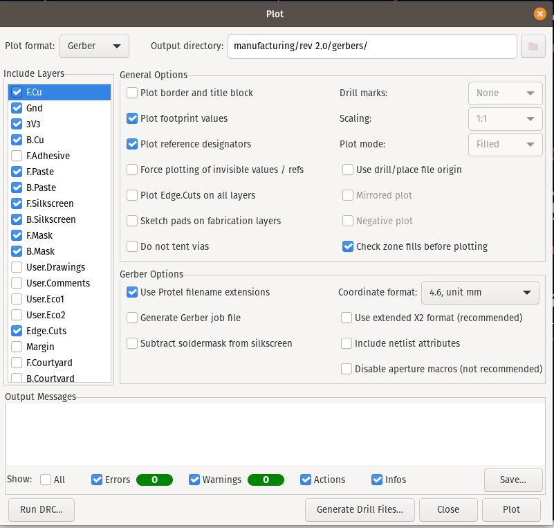
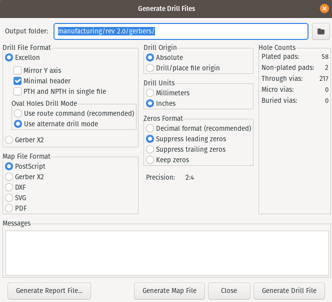
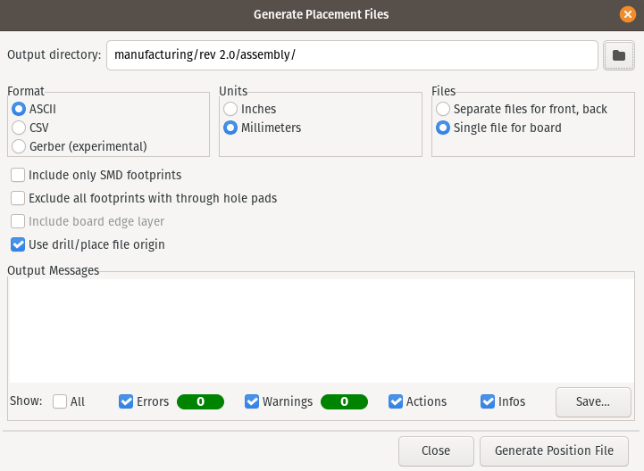

# Introduction
PCB Manufacturers have slightly differing options in how they receive gerber and assembly files. They usually provide a help section  on their websites that tells users how to generate files to work with their systems for a host of different schematic and PCB programs. As this project was built with KiCad and ordered from PCBWay, we will go through an example generating the files from KiCad for a PCBWay order.

# 1. Find Fabrication House Parameters
A quick google search should lead to PCBWay's instruction on generating gerber files from kicad. That leads to the webpage [Generate Gerber file from Kicad](https://www.pcbway.com/helpcenter/technical_support/Generate_Gerber_file_from_Kicad.html), which is a step-by-step instruction on generating the files on KiCad. Unfortunately however, the instructions are for an older version of KiCad and the current version has differing names/options to select, but you can still generate the same files.

In adition to the gerbers, the centroid (pick and place) file for assembly also needs to be created. You find the instructions the same way, and [this](https://www.pcbway.com/helpcenter/technical_support/Generate_Position_File_in_Kicad.html) is the PCBWay instruction webpage.

# 2. Generating Gerbers and Drill Files on KiCad 6

## 2.2 Generating Gerbers
The steps on the pcbway page are the same, open `File -> Plot` and you will be greeted with the plot screen. The following image is the settings that PCBWay requires, but on Kicad 6:

    

Once satisfied with the settings, click on plot and the files will be generated and placed in the directory of your choice.

## 2.2 Generating Drill Files
With the gerbers generated, click on generate drill files. The settings that need to be selected are shown in the image below.

    

Once satisfied, click on generate drill file.

# 3. Generating Centroid File on KiCad 6
The origin point should already be set in the project. However if not, you can set it the same way as PCBWay instruct.
To open the placement file wizard, navigate to `File -> Component Placement (.pos)`. The following image shows the settings that must be selected.

    

Click on Generate Promote File.