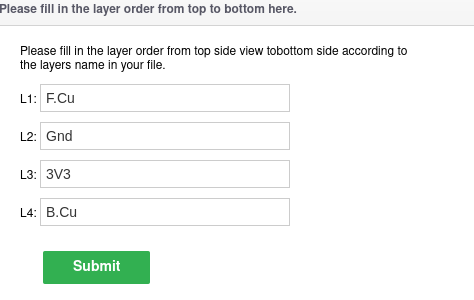
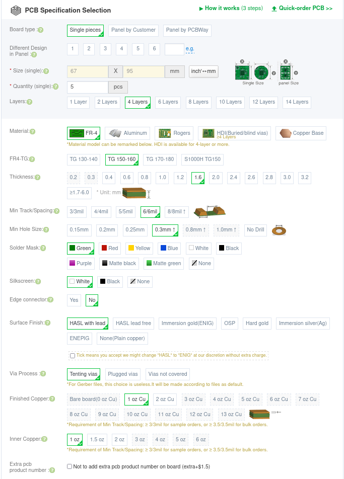
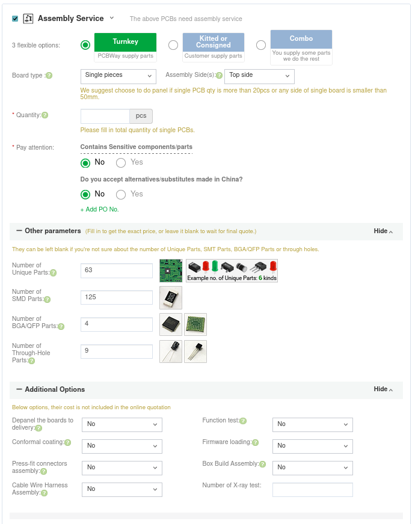

# Introduction
The PCB manufacturer that was used to fabricate the prototype was [PCBWay](https://www.pcbway.com/). You are not strictly confined to use this manufacturer and can generate the required files to match one of your choice. However if you choose this manufacturer, the files are already generated in the correct format. These can be found in `PCB/LoRaDongle_iCE40_USB/manufacturing/rev 2.0`. The LoRaDongle BOM is also found in this directory. 

Choosing a different manufacturer may also require changing the track sizes of the RF section so as to impedance match to 50&#8486;. This is due to the different stackup that would be used.

# 1. Ordering from PCBWay
NB: The following instructions are for the already generated gerber files. To generate your own for a different manufcaturer, please look at [Generating Gerbers for a different fabrication house](generate_gerbers).

## 1.1 Inputting PCB Parameters
Go to the PCBWay website. On the top of homepage of the website there is an instant prototype quote section. Input the PCB parameters (67mm x 95mm, 4 layers, 1.6mm thicnkess) and click quote now. You will be taken to a quote page where you are given a price for the information you put. You may need to name the layers before being taken to the quote page. The names are as follows:

    

Once on the order online/quote page, you are greeted with more options to order. The image below shows the settings required to be chosen when ordering from PCBWay. They pertain to the PCB characteristics and therefore should be applicable to most manufactures. 

    

The important parameters to input are the baord size and number of layers, and pcb thickness. Changing the thickness alters the stackup which could affect the efficiency of the RF section of the board.

## 1.2 Assembly Options
Afther the PCB parameters section, there should be an assembly service checkbox that is automatically deselected. Select it to request assembly.

The image below shows the required input options for LoRaDongle. The turnkey service is used to source the parts on the board, with parts not already in stock ordered from reputable sources (digikey, mouser, etc). To do this, the BOM is also submitted with the pick and place file. PCBWay will be in contact with a quote and information about the components in stock or not.

    

## 1.3 Submitting order and Uploading files
Once the PCB specification and assembly service sections have been filled, click calculate to get the quote. You would also be required to choose the shipping destination and preferred courier. These choices will also affect final price. 

Once satisfied, click add to card and your order will be sent to PCBWAy. However this is not complete, it is now you will be prompted to upload the necessary files. As mentioned in the introduction, these are found in `PCB/LoRaDongle_iCE40_USB/manufacturing/rev 2.0`. The files you need to upload are:
* LoRaDongleV2_BOM.csv
* gerbers/LoRaDongle_V2.zip
* assembly/LoRaDongle_iCE40-all.pos
* assembly/LoRaDongleV2_pdfs.zip

The assembly PDFs are not necessary but help the PCBWay engineers in insuring the assembly process is in line with your designs.