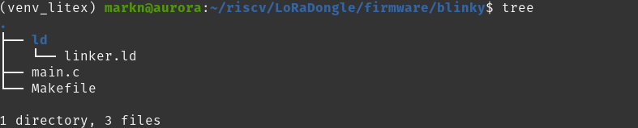
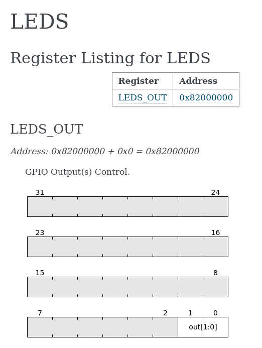
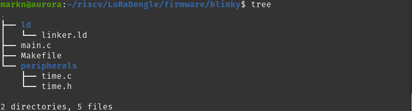

# Introduction
The demo SoC application is a working implementation of a program running on the SoC. You would obviously want to write your own firmware to run, and so this section describes how to do just that. It focuses on the C code specifically, as the linker files are dependent on the SOC and it's assumed the SOC is unchanged.

# Setting up the working directory
The location of the source files are not imperative, the only important thing is to ensure the makefile is aware of where to get them. For this tutorial, we will create a subdirectory in the firmware directory; `mkdir blinky`. 

Copy the `ld` directory found in the demo application to your new directory. The file is the same as the SoC is unchanged. Next you'll need a `main.c` and a `Makefile` to store the code and toolchain. Your new directory should now look like this:
<div>
    
</div>

# Writing C Code

## What register to write to
The LED we will be turning on is the RX LED located below header J9. Looking at the platform definition of the board, we see that the two LEDS are set up under the peripheral `user_leds` ;

```python
# Leds
("user_led", 0, Pins("E4"),  IOStandard("LVCMOS33")),           #RX LED
("user_led", 1, Pins("F4"),  IOStandard("LVCMOS33")),           #TX LED
```

The leds are then called into the SOC in the target script under the name `leds`. We can see we are using the `gpio` core that LiteX has in the source files. It hanled input pins, output pins and biderictional pins. As we are working with LEDs, the output class `GPIOOut()` is used.
```python
# Leds
user_leds = Cat(*[platform.request("user_led", i) for i in range(2)])
self.submodules.leds = gpio.GPIOOut(user_leds)
self.add_csr("leds")
```
LiteX then generates the necessary header file containing the macro functions to interact with the LED register. This is found in the `csr.h` as mentioned in the [Programming SoC](../getting-started/programming_SOC) page. The necessary section of the file is under the led section, and is shown below:

```c
/* leds */
#define CSR_LEDS_BASE (CSR_BASE + 0x0L)
#define CSR_LEDS_OUT_ADDR (CSR_BASE + 0x0L)
#define CSR_LEDS_OUT_SIZE 1
static inline uint32_t leds_out_read(void) {
	return csr_read_simple(CSR_BASE + 0x0L);
}
static inline void leds_out_write(uint32_t v) {
	csr_write_simple(v, CSR_BASE + 0x0L);
}
```
As you can see, the location in memory is created as macros and is used in simple functions `leds_out_read()` and `leds_out_write()`. To utilise them, they just need to be called in the source code.

## Writing main.c
Looking at the generated documentation, you find that the generated register has the two LSBs available to be written to. The combinations of values that can be written are `0b00`, `0b01`, `0b10` and `0b11`. Each bit corresponds to an LED pin it has been mapped to in the platform. So in this case, bit 0 corresponds to the RX LED and bit 1 corresponds to the TX LED.

<div>

</div>


Write the following code into `main.c`

```c
#include <generated/csr.h>

int main(void){
	leds_out_write(0x1);	
	return 0;
}
```

The program is very simple and simply writes a value of 1 to the CSR register, and turns on the LED. 

The code needs now needs to be compiled, and that involves writing the makefile. 


# Makefile
While the code so far is quite simple, setting up the toolchain via the proper structuring of the makefile is slighlty more complex. You need to tell the compiler certain things like where to find the source  and linker files, what flags to use and how to relate different outputs of the compilation process. To properly navigated the makefile, there are also variable names that are used, and most important of which is macros for the directories of important files. 

Using makefiles can become very complex and this section is a minimal introduction on how to make the most efficient version for the LoRaDongle. A more in depth tutorial on how to set up makefiles can be found easily online.

## Directory Variables
The first thing to include in the makefile is the required directories. The following code is used to do that:

```makefile
BUILD_DIR?=../../SOC/main/build/LoRaDongle

include $(BUILD_DIR)/software/include/generated/variables.mak
include $(SOC_DIRECTORY)/software/common.mak

BASE_DIR = .
OBJ_DIR = .obj
LD_DIR = $(BASE_DIR)/ld
```

`variables.mak` and `common.mak` are litex generated files that have even more macros that you would want to use in the compilation process. This includes the directory the SOC was built in, the directory of the CPU being used, the necessary flags to run the compiler for the chosen cpu, the compilation and linking flags and more. With these set up, you can move on to the next stage.

## Source files and flags
The makefile operates on specific file names as the dependency for a target. However, projects with many files would therefore need endless number of targets which would make the makefile long and repitive. So we want a way to go through chosen directories and generate a list of files. This is done with the `wildcard` function, and is implemented in the following way:

```makefile
CSOURCES   := $(wildcard *.c) 
ASOURCES   := $(wildcard $(CPU_DIRECTORY)/crt0.S)
```

This way, the variable `CSOURCES` will contain a list of files that all contain the ending `.c` and the same can be said about `ASOURCES`. While we are here, let's also create a variable for where the object files will be stored:

```makefile
COBJS      := $(addprefix $(OBJ_DIR)/, $(notdir $(CSOURCES:.c=.o)))
AOBJS      := $(addprefix $(OBJ_DIR)/, $(notdir $(ASOURCES:.S=.o)))
OBJECTS = $(COBJS) $(AOBJS)
```

Now, you can add more c files in the blinky directory and would not need to add targets to the makefile. We will add more to this section later when we are trying to blink the led. 
Something else that will come into effect later is updating the flags to include directories to search for header files. To set that infrastructure up, we are going to add the following lines to the makefile:

```makefile
c_flags =  $(CFLAGS)
l_flags = $(LDFLAGS)

define compile
$(CC) -c $(c_flags) $(1) $< -o $@
endef
```


## Targets
Here, the whole compilation process is broken down to get the compiler to do exactly what we want. This is espeically important when it comes to the linking step, which is where the linker script found in `ld/` is included. The following code is used to compile the targets, assemble the assembly code and finally link the object files into a single executable.

```makefile
$(OBJECTS): | $(OBJ_DIR)

$(OBJ_DIR):
	@mkdir $(OBJ_DIR)

# pull in dependency info for *existing* .o files
-include $(OBJECTS:.o=.d)

%.bin: %.elf
	$(OBJCOPY) -O binary $< $@
	chmod -x $@

blinky.elf: $(OBJECTS)
	$(CC) $(l_flags) \
		-T $(LD_DIR)/linker.ld \
		-N -o $@ \
		$(OBJECTS) \
		$(PACKAGES:%=-L$(BUILD_DIR)/software/%) \
		$(LIBS:lib%=-l%)
	chmod -x $@

$(OBJ_DIR)/main.o: main.c
	$(compile)

$(OBJ_DIR)/crt0.o: $(CPU_DIRECTORY)/crt0.S
	$(assemble)

%.o: %.S
	$(assemble)

```

As you can see, the targets all have dependencies, and in some cases the dependencies are other targets. This creates a step by step process in the compilation. A simplified version of this is as follows:
1. Compile the .c source files to object files
2. Assemble the .s source files to object files
3. Link the object files to create the .elf file
4. Change the file format to a .bin. 


### Programming board and cleaning up
Ypu can also create a target that runs the bash command to load the executable file into the SPIFlash of the SOC. This is so that you don't have to remember the command to run as it's much easier to run `make prog`:

```makefile
prog: blinky.bin
	iceprog -o 0x00020000 $<
```

You would also want a way to delete all the generated files and 'clean up' any generated files. And lastly, it's good practice to tell make which dependcies are not actually files that already exist in the directory. This is done in the following lines:

```makefile
clean:
	$(RM) $(OBJECTS) $(OBJECTS:.o=.d) blinky.elf blinky.bin .*~ *~
	$(RM) -r $(OBJ_DIR)

.PHONY: all $(OBJ_DIR)/main.o clean run
```

# Final Makefile
WIth all key sections in the makefile now, your makefile should look like this:

```makefile
BUILD_DIR?=../../SOC/main/build/LoRaDongle

include $(BUILD_DIR)/software/include/generated/variables.mak
include $(SOC_DIRECTORY)/software/common.mak

BASE_DIR = .
OBJ_DIR = .obj
LD_DIR = $(BASE_DIR)/ld


CSOURCES   := $(wildcard *.c) 
ASOURCES   := $(wildcard $(CPU_DIRECTORY)/crt0.S)
COBJS      := $(addprefix $(OBJ_DIR)/, $(notdir $(CSOURCES:.c=.o)))
AOBJS      := $(addprefix $(OBJ_DIR)/, $(notdir $(ASOURCES:.S=.o)))

OBJECTS = $(COBJS) $(AOBJS)

c_flags =  $(CFLAGS)
l_flags = $(LDFLAGS)

define compile
$(CC) -c $(c_flags) $(1) $< -o $@
endef


all: blinky.bin

$(OBJECTS): | $(OBJ_DIR)

$(OBJ_DIR):
	@mkdir $(OBJ_DIR)

# pull in dependency info for *existing* .o files
-include $(OBJECTS:.o=.d)

%.bin: %.elf
	$(OBJCOPY) -O binary $< $@
	chmod -x $@

blinky.elf: $(OBJECTS)
	$(CC) $(l_flags) \
		-T $(LD_DIR)/linker.ld \
		-N -o $@ \
		$(OBJECTS) \
		$(PACKAGES:%=-L$(BUILD_DIR)/software/%) \
		$(LIBS:lib%=-l%)
	chmod -x $@

$(OBJ_DIR)/main.o: main.c
	$(compile)

$(OBJ_DIR)/crt0.o: $(CPU_DIRECTORY)/crt0.S
	$(assemble)


%.o: %.S
	$(assemble)


prog: blinky.bin
	iceprog -o 0x00020000 $<

clean:
	$(RM) $(OBJECTS) $(OBJECTS:.o=.d) blinky.elf blinky.bin .*~ *~
	$(RM) -r $(OBJ_DIR)

.PHONY: all $(OBJ_DIR)/main.o clean run
```


Go ahead and run `make` to compile the earlier program, and then `make prog` to load it onto the board. If successful, you should see the RX LED turn on!


# Adding peripherals to make the LED blink
Naturally, now we would like the LED to blink on and off. To do this we would need to incorporate timers that set the frequency of the blink. A timer peripheral is set up automatically with all SOCs, so that is what we're going to use. 

## Getting the timer peripheral source files
Make a new directory in `blinky/` and name it peripherals and copy `timer.h` and `timer.c` from  `demo/peripherals` into your new directory. The structure should look like:

<div>
    
</div>


## Updating main.c
There are two functions that utilise the timer as a counter. We will use `elapsed()` for this. Update `main.c` so that it has the following code:

```c
#include <generated/csr.h>
#include <time.h>

int main(void){
	time_init();
	int last_event = 0;
	int led_value;
	while (1) {
		//Flash LED every half a second
		if (elapsed(&last_event, (CONFIG_CLOCK_FREQUENCY * 0.5))){
			led_value = leds_out_read();
			leds_out_write(led_value ^ 1);
			}
	}
	return 0;
}
```

## Updating the makefile
Each section barre the last one needs to be updated, this is mostly because a new directory has been created. 

### Adding peripheral directory
In the section where you declare directory variables, add the following:
```makefile
PERIPHERAL_DIR = $(BASE_DIR)/peripherals
```

### Updating source files and flags
Using the `wildcard` function, update `CSOURCES` to contain files that come from `peripherals/`:
```makefile
CSOURCES   := $(wildcard *.c) $(wildcard $(PERIPHERAL_DIR)/*.c)
```

You also want to update the flags to include the header files in `peripherals/`. If you don't do this, the compiler won't know where the corresponding header files for the soruce files are found. 

```makefile
LOCAL_INCLUDE = -I$(PERIPHERAL_DIR)
L_INCLUDE = -L$(PERIPHERAL_DIR)

c_flags = $(LOCAL_INCLUDE) $(CFLAGS)
l_flags = $(L_INCLUDE) $(LOCAL_INCLUDE) $(LDFLAGS)
```


### Adding a new target
The last change to the makefile is to add a new target that sources the c files from the peripheral directory and compiles them to the object files. This is done just like it was with `main.c`. 

```makefile
$(OBJ_DIR)/%.o: $(PERIPHERAL_DIR)/%.c 
	$(compile)
```

With the final change done, you can run `make` and `make prog` again to load the new program. If successful, you should see the RX Led blinking!